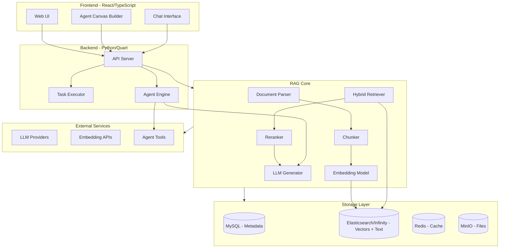
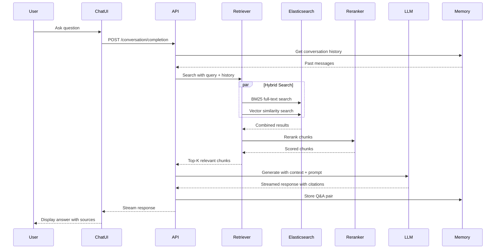
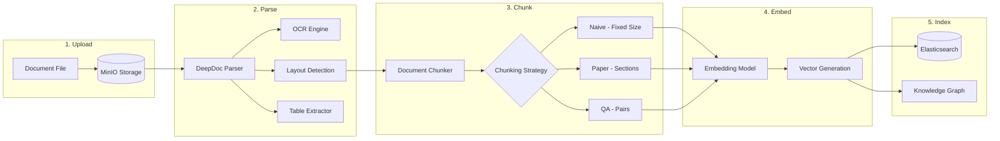
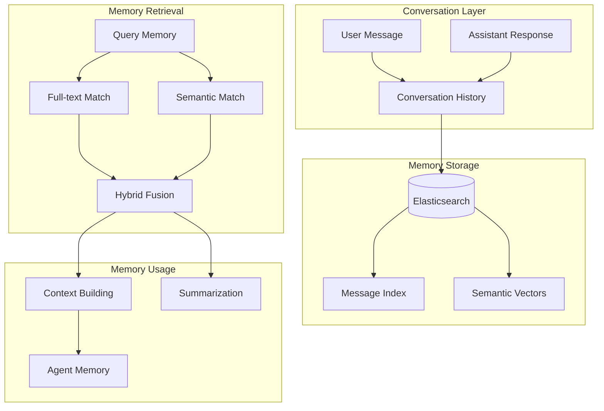
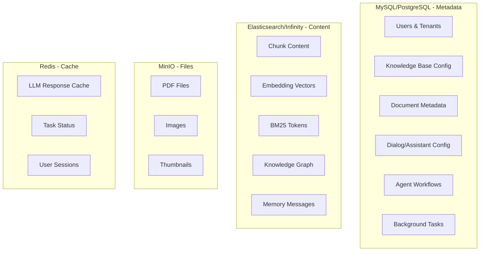
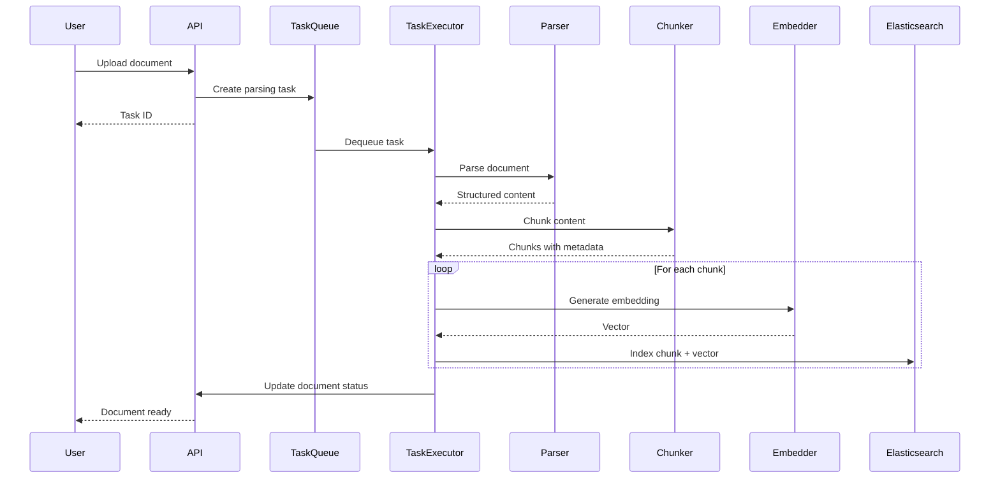
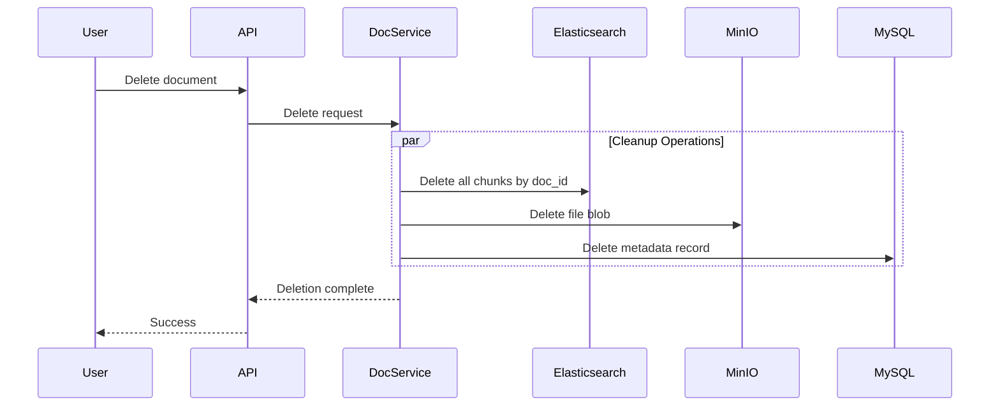
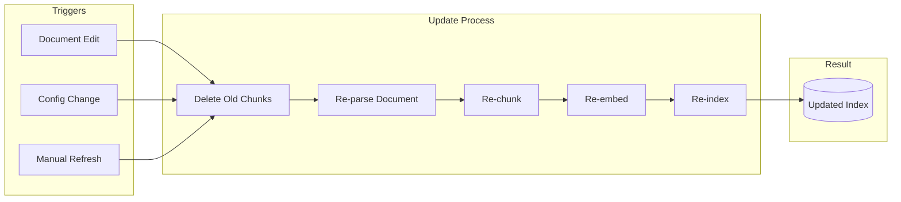
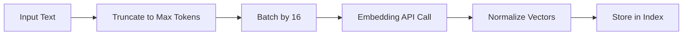
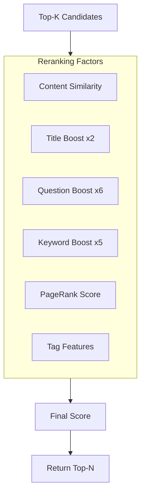

# RAGFlow Deep Learning Plan

## Part 1: System Architecture Overview

### High-Level Architecture



### End-to-End Query Flow (User Perspective)



### Document Ingestion Pipeline



### Memory System Architecture



### Data Storage Architecture

RAGFlow uses a **polyglot persistence** strategy - different databases for different purposes:



#### What Goes Into MySQL (Relational Database)

| Table | Purpose | Key Fields |

|-------|---------|------------|

| `user` | User accounts | id, email, password, avatar, language |

| `tenant` | Organization/workspace | id, llm_id, embd_id, rerank_id |

| `knowledgebase` | KB configuration | id, name, embd_id, similarity_threshold, chunk_num |

| `document` | Document metadata (NOT content) | id, kb_id, name, size, progress, parser_config |

| `dialog` | Assistant configuration | id, llm_id, prompt_config, kb_ids, top_n |

| `conversation` | Conversation references | id, dialog_id, message (JSON refs) |

| `user_canvas` | Agent workflow DSL | id, title, dsl (JSON) |

| `tenant_llm` | LLM API keys per tenant | tenant_id, llm_factory, api_key |

| `task` | Background job queue | id, doc_id, progress, retry_count |

| `memory` | Memory configuration | id, name, embd_id, llm_id, memory_type |

**Key Files:**

- [api/db/db_models.py](api/db/db_models.py) - All table definitions

#### What Goes Into Elasticsearch/Infinity (Vector Store)

Each chunk is stored as a document with this schema:

```
Chunk Document Schema (from conf/mapping.json):
├── content_ltks      → Tokenized content for BM25 (text, whitespace analyzer)
├── content_with_weight → Raw content with formatting (text, not indexed)
├── title_tks         → Tokenized title for BM25
├── q_512_vec         → Dense vector (512 dimensions, cosine similarity)
├── q_768_vec         → Dense vector (768 dimensions)
├── q_1024_vec        → Dense vector (1024 dimensions)
├── q_1536_vec        → Dense vector (1536 dimensions)
├── doc_id            → Reference to MySQL document (keyword)
├── kb_id             → Reference to MySQL knowledge base (keyword)
├── docnm_kwd         → Document name (keyword)
├── page_num_int      → Page number (integer)
├── position_int      → Position within page (integer)
├── top_int           → Vertical position (integer)
├── img_id            → Associated image ID (keyword)
├── important_kwd     → Extracted keywords (keyword)
├── question_kwd      → Generated questions (keyword)
├── knowledge_graph_kwd → "entity" | "relation" | "community_report"
├── entity_kwd        → Entity name for GraphRAG (keyword)
├── from_entity_kwd   → Relation source entity (keyword)
├── to_entity_kwd     → Relation target entity (keyword)
├── tag_fea           → Tag features for ranking (rank_feature)
├── rank_flt          → PageRank score (float)
└── available_int     → Soft delete flag (integer)
```

**Field Naming Conventions:**

| Suffix | Type | Purpose |

|--------|------|---------|

| `*_kwd` | keyword | Exact match filtering |

| `*_tks` | text (whitespace) | Full-text search with custom IDF |

| `*_ltks` | text (whitespace) | Long text, standard BM25 |

| `*_vec` | dense_vector | Semantic similarity search |

| `*_int` | integer | Numeric filtering/sorting |

| `*_flt` | float | Numeric scores |

| `*_fea` | rank_feature | Ranking boost factors |

**Key Files:**

- [conf/mapping.json](conf/mapping.json) - Elasticsearch index mapping
- [common/doc_store/es_conn_base.py](common/doc_store/es_conn_base.py) - ES operations
- [common/doc_store/infinity_conn_base.py](common/doc_store/infinity_conn_base.py) - Infinity operations

#### Supported Vector Stores

RAGFlow supports two vector store backends:

**1. Elasticsearch (Default)**

- Uses `dense_vector` type with HNSW index
- Cosine similarity for vector search
- Custom BM25 scoring with scripted IDF
- Mature, widely deployed, good tooling

**2. Infinity (Alternative)**

- Built by InfiniFlow (same company as RAGFlow)
- Optimized for RAG workloads
- Switch via `DOC_ENGINE=infinity` in docker/.env

```python
# From common/settings.py
DOC_ENGINE_INFINITY = os.environ.get("DOC_ENGINE", "").lower() == "infinity"
```

#### Storage Decision Guide

| Data Type | Store | Why |

|-----------|-------|-----|

| User accounts | MySQL | ACID, authentication queries |

| KB settings | MySQL | Relational integrity, config management |

| Document metadata | MySQL | Progress tracking, status updates |

| Chunk content | ES/Infinity | Full-text + vector search |

| Embeddings | ES/Infinity | ANN (Approximate Nearest Neighbor) |

| Knowledge graph | ES/Infinity | Graph queries via entity filters |

| Original files | MinIO | Large binary objects |

| LLM cache | Redis | Fast key-value lookup, TTL |

---

## Part 2: Learning-by-Building Roadmap

### Phase 1: Core Retrieval (Build a Mini-RAG)

**Goal:** Understand hybrid search by building a simplified retriever.

**Key Files to Study:**

- [rag/nlp/search.py](rag/nlp/search.py) - `Dealer` class, `retrieval()` method
- [rag/nlp/query.py](rag/nlp/query.py) - Query expansion and processing
- [rag/llm/embedding_model.py](rag/llm/embedding_model.py) - Embedding abstraction

**Hands-on Project 1:** Build a minimal hybrid search

```python
# What you'll learn:
# 1. BM25 tokenization and scoring
# 2. Vector encoding with embeddings
# 3. Weighted fusion of results
# 4. Reranking with cross-encoders
```

**Checkpoints:**

- [ ] Index 10 documents into Elasticsearch
- [ ] Implement BM25 search
- [ ] Add vector search with embeddings
- [ ] Combine with weighted fusion
- [ ] Add reranking

---

### Phase 2: Document Processing (Build a Parser)

**Goal:** Understand deep document understanding.

**Key Files to Study:**

- [deepdoc/parser/pdf_parser.py](deepdoc/parser/pdf_parser.py) - PDF extraction
- [deepdoc/vision/layout_recognizer.py](deepdoc/vision/layout_recognizer.py) - Layout detection
- [rag/app/naive.py](rag/app/naive.py) - Basic chunking
- [rag/app/paper.py](rag/app/paper.py) - Academic paper chunking

**Hands-on Project 2:** Build a document chunker

```python
# What you'll learn:
# 1. PDF text extraction with layout
# 2. Table detection and extraction
# 3. Chunking strategies (fixed, semantic, hierarchical)
# 4. Metadata preservation
```

**Checkpoints:**

- [ ] Extract text from PDF preserving structure
- [ ] Implement fixed-size chunking
- [ ] Add semantic chunking by headers
- [ ] Preserve page numbers and positions

---

### Phase 3: Generation with Citations (Build a Generator)

**Goal:** Understand prompt engineering and citation insertion.

**Key Files to Study:**

- [rag/prompts/generator.py](rag/prompts/generator.py) - Prompt formatting
- [rag/prompts/citation_prompt.md](rag/prompts/citation_prompt.md) - Citation template
- [rag/llm/chat_model.py](rag/llm/chat_model.py) - LLM abstraction

**Hands-on Project 3:** Build a citation-aware generator

```python
# What you'll learn:
# 1. Context window management
# 2. Prompt template design
# 3. Citation insertion algorithm
# 4. Streaming responses
```

**Checkpoints:**

- [ ] Format retrieved chunks into prompt
- [ ] Generate response with LLM
- [ ] Insert citations post-generation
- [ ] Handle context overflow

---

### Phase 4: Knowledge Graph (Build GraphRAG)

**Goal:** Understand entity extraction and graph-based retrieval.

**Key Files to Study:**

- [graphrag/general/graph_extractor.py](graphrag/general/graph_extractor.py) - Entity/relation extraction
- [graphrag/general/community_reports_extractor.py](graphrag/general/community_reports_extractor.py) - Community summarization
- [graphrag/search.py](graphrag/search.py) - Graph-based retrieval

**Hands-on Project 4:** Build a mini knowledge graph

```python
# What you'll learn:
# 1. Named entity recognition
# 2. Relation extraction with LLM
# 3. Community detection (Leiden algorithm)
# 4. Graph-enhanced retrieval
```

**Checkpoints:**

- [ ] Extract entities from text
- [ ] Extract relationships between entities
- [ ] Build graph and detect communities
- [ ] Query using graph structure

---

### Phase 5: Memory System (Build Conversation Memory)

**Goal:** Understand how RAG maintains context across conversations.

**Key Files to Study:**

- [memory/services/query.py](memory/services/query.py) - Memory retrieval
- [memory/services/messages.py](memory/services/messages.py) - Message storage
- [api/db/services/memory_service.py](api/db/services/memory_service.py) - Memory service

**Hands-on Project 5:** Build a memory system

```python
# What you'll learn:
# 1. Storing conversation turns
# 2. Semantic search over history
# 3. Memory summarization
# 4. Context window optimization
```

**Checkpoints:**

- [ ] Store messages with embeddings
- [ ] Retrieve relevant past context
- [ ] Implement conversation summarization
- [ ] Integrate memory into retrieval

---

### Phase 6: Agent System (Build a Workflow)

**Goal:** Understand agentic orchestration with tools.

**Key Files to Study:**

- [agent/canvas.py](agent/canvas.py) - Workflow execution engine
- [agent/component/base.py](agent/component/base.py) - Component base class
- [agent/tools/retrieval.py](agent/tools/retrieval.py) - RAG as a tool

**Hands-on Project 6:** Build a simple agent

```python
# What you'll learn:
# 1. Tool definition and binding
# 2. ReAct pattern for reasoning
# 3. Multi-step planning
# 4. Error handling and retries
```

**Checkpoints:**

- [ ] Define tools (search, calculator, etc.)
- [ ] Implement tool calling with LLM
- [ ] Build a multi-step workflow
- [ ] Add reflection and retry logic

---

## Part 3: RAG Update Lifecycle (Add/Remove Documents)

### Document Addition Flow



**Key Files:**

- [rag/svr/task_executor.py](rag/svr/task_executor.py) - Background task processing
- [api/db/services/document_service.py](api/db/services/document_service.py) - Document CRUD
- [api/apps/document_app.py](api/apps/document_app.py) - Document API endpoints

### Document Removal Flow



**Key Files:**

- [api/db/services/document_service.py](api/db/services/document_service.py) - `delete_by_id()` method
- [common/doc_store/doc_store_base.py](common/doc_store/doc_store_base.py) - Delete operations

### Incremental Update (Re-indexing)



---

## Part 4: Detailed Component Deep Dives

### 4.1 Hybrid Search Algorithm

```python
# From rag/nlp/search.py - Core retrieval logic
# Weights: 5% BM25 + 95% Vector (configurable)

fusionExpr = FusionExpr("weighted_sum", topk, {"weights": "0.05,0.95"})
matchExprs = [matchText, matchDense, fusionExpr]
```

**Study Path:**

1. `rag/nlp/query.py` - How queries are tokenized and expanded
2. `rag/nlp/term_weight.py` - TF-IDF weighting
3. `rag/nlp/synonym.py` - Synonym expansion
4. `common/doc_store/es_conn_base.py` - Elasticsearch query building

### 4.2 Embedding Pipeline



**Study Path:**

1. `rag/llm/embedding_model.py` - Provider abstraction
2. `common/token_utils.py` - Token counting and truncation

### 4.3 Reranking Strategy



**Study Path:**

1. `rag/nlp/search.py` - `rerank()` and `rerank_by_model()` methods
2. `rag/llm/rerank_model.py` - Reranker providers

### 4.4 Memory Query System

```python
# From memory/services/query.py
# Memory uses same hybrid search as RAG

class MsgTextQuery(QueryBase):
    def question(self, txt, tbl="messages", min_match=0.6):
        # BM25 + synonym expansion
        # Returns MatchTextExpr for hybrid search
```

**Study Path:**

1. `memory/services/query.py` - Memory search query building
2. `memory/services/messages.py` - Message CRUD operations
3. `api/utils/memory_utils.py` - Memory integration utilities

---

## Part 5: Build Your Own RAG Checklist

After completing all phases, you should be able to build:

### Minimum Viable RAG

- [ ] Document ingestion pipeline
- [ ] Chunking with overlap
- [ ] Embedding generation
- [ ] Vector storage (Elasticsearch/Pinecone/Qdrant)
- [ ] Hybrid search (BM25 + vector)
- [ ] LLM generation with context
- [ ] Citation insertion

### Production-Grade RAG

- [ ] Multiple document types (PDF, Word, Excel)
- [ ] Layout-aware parsing
- [ ] Multiple chunking strategies
- [ ] Reranking with cross-encoders
- [ ] GraphRAG for multi-hop reasoning
- [ ] Conversation memory
- [ ] Agent workflows with tools
- [ ] Streaming responses
- [ ] Token management
- [ ] Error handling and retries

### Enterprise Features

- [ ] Multi-tenancy
- [ ] Access control
- [ ] Usage tracking
- [ ] Model fallbacks
- [ ] Caching layer
- [ ] Async task processing
- [ ] Monitoring and logging

---

## Part 6: Recommended Study Order

1. **Day 1-3:** Run RAGFlow locally, explore UI, upload documents
2. **Day 4-7:** Study `rag/nlp/search.py` and implement mini retriever
3. **Day 8-10:** Study `deepdoc/parser/` and implement document parser
4. **Day 11-14:** Study `rag/prompts/generator.py` and build generator
5. **Day 15-18:** Study `graphrag/` and implement entity extraction
6. **Day 19-21:** Study `memory/` and implement conversation memory
7. **Day 22-25:** Study `agent/canvas.py` and build simple agent
8. **Day 26-30:** Integrate all components into your own RAG system
